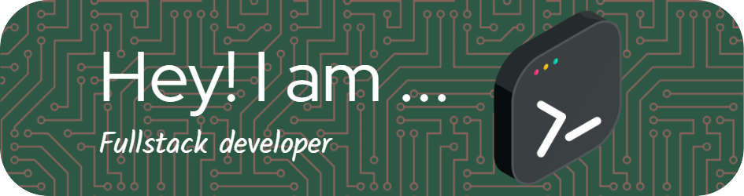

<header>
  <h1>Hi there 👋, I'm <a href="https://github.com/King-Priyanshu" target="_blank" style="color: #61dafb;">PRIYANSHU</a></h1>
  <h3>💻 Developer | 🚀 Tech Enthusiast | 📚 Lifelong Learner</h3>
</header>

  

<section>
  <h2>About Me 🚀</h2>
  <ul>
    <li>🎓 <strong>Education:</strong> Diploma in Computer Engineering</li>
    <li>💼 <strong>Currently working on:</strong> Full Stack Web Development</li>
    <li>🎯 <strong>Interests:</strong> AI, ML, Android, Web Development</li>
    <li>📫 <strong>How to reach me:</strong> kingprincepriyanshu1138@gmail.com, <a href="https://www.linkedin.com/in/priyanshu-7581932a8/">LinkedIn Profile</a></li>
  </ul>
</section>

<section class="tech-stack">
  <h2>🔧 Tech Stack</h2>
  <h3>Programming Languages</h3>
  

    
    
    
    
    
    
  

  <h3>Frameworks and Tools</h3>
  

    
    
    
    
    
    
    
    
    
    
    
    
    
  

</section>

<section>
  <h2>📊 GitHub Stats</h2>
  

    
    
  

</section>

<section>
  <h2>🏆 Achievements</h2>
  <ul>
    <li>🏅 [Achievement 1]</li>
    <li>🥇 [Achievement 2]</li>
    <li>🚀 [Achievement 3]</li>
  </ul>
</section>

<section>
  <h2>🎯 Git Trophies</h2>
  

    
  

</section>

<section>
  <h2>🌐 Connect with Me</h2>
  

    
    
  

</section>

<footer>
  
✨ Feel free to explore my repositories and connect with me!

</footer>
